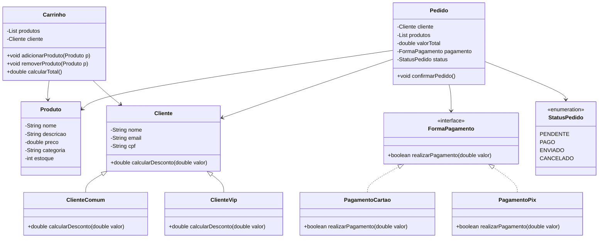

# Sistema de e-Commerce

## Descrição

Neste projeto, você deverá desenvolver uma aplicação de e-commerce simplificada utilizando os princípios da Programação Orientada a Objetos (POO). O sistema deve permitir o cadastro de produtos, gerenciamento de clientes, criação de pedidos e simulação de pagamentos. A aplicação será construída com foco em boas práticas de modelagem orientada a objetos, incluindo o uso de **classes**, **interfaces**, **enums** e **herança**.

## Objetivo

Criar um sistema básico de loja virtual com produtos, carrinho de compras e formas de pagamento. Neste projeto será trabalhado:

- Aplicação de conceitos fundamentais de POO em um projeto prático;
- Utilização de interfaces para representar comportamentos comuns;
- Utilização de enums para representar estados e categorias fixas;
- Implementação de herança de classes para modelar diferentes tipos de clientes;
- Simulação do fluxo básico de um pedido em uma loja virtual.

## Requisitos Funcionais

1. Cadastro de Produtos
    - Cada produto deve ter: nome, descrição, preço, categoria e estoque disponível.

1. Cadastro de Clientes
    - Os clientes devem ser divididos em pelo menos dois tipos: ClienteComum e ClienteVip.
    - Ambos devem herdar da classe base Cliente.
    - Clientes comuns devem receber ofertas para se tornar VIP em toda compra;
    - Clientes VIP devem ter acesso a produtos especiais.
    - Clientes VIP devem receber desconto automático nas compras (por exemplo, 10%).

1. Carrinho de Compras
    - Deve permitir adicionar e remover produtos.
    - Deve calcular o valor total da compra, aplicando o desconto conforme o tipo de cliente.
      - Os clientes comuns só receberão desconto para compras acima de R$ 150,00.
        - Desconto será gradativo, começando em 2% e chegando até 5% para compras acima de R$ 300,00.
      - Clientes VIP sempre tem descontos, começando em 5% e podendo chegar a 10% para compras acima de R$ 200,00
    - Deve mostrar mensagens da loja na compra, sendo promoções especiais para os VIP e vantagens de se tornar um VIP para comuns.

1. Pedidos
    - Um pedido deve conter: cliente, lista de produtos, valor total, forma de pagamento e status.
    - O status do pedido deve ser representado por um enum com os valores: PENDENTE, PAGO, ENVIADO, CANCELADO.

1. Formas de Pagamento

    - Criar uma interface chamada Pagamento com o método realizarPagamento().
    - Implementar pelo menos duas formas de pagamento: PagamentoCartao e PagamentoPix.

1. Relatórios
    - Exibir um resumo dos pedidos realizados, com status e valores.

### Material de auxílio

O diagrama de classes a seguir é uma modelagem do sistema a ser desenvolvido e está aqui para servir deguia para a implementação do sistema.

